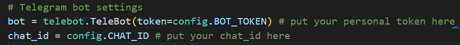

## Packaging Python projects

### Overview
This repo about learning packaging Python project by example my personal project - Telegram Messenger Bot.

**Goal**: Get started learning some basic software engineering concepts. By the end of the week I've learned how successfully developed a Python package while incorporating essential best practices. These practices include executing unit tests, running a linter, and ensuring proper documentation to enhance the overall functionality and maintainability of your package.

**Dates**: from 30th August to 4th September.

### Project Description
As a working python code I use my [Telegram Messenger Python Bot](https://core.telegram.org/bots/api) code. This bot allows you convert currency pair whatever you want. For this project I worked with [pyTelegramBotAPI](https://pypi.org/project/pyTelegramBotAPI/) and [CurrencyConverter](https://pypi.org/project/CurrencyConverter/) libraries.

### Step-by-step guide
1. First of all check this official [Telegram Bot install instruction](https://core.telegram.org/bots) to create your personal Bot. 

    After following steps you get your personal bot_token and chat_id, which **you have to put in main code section (see picture below)**




2. Clone this repo:
```bash
git clone https://github.com/tmeach/project-of-the-week.git
```

3. Move to project directory:
```bash
cd PackagingPythonProjects
```
4. Install dependicies:
```bash
pip install -r requirements.prod
pip install -r requirements.dev
```
Note that you can also run bot in Docker container: 
```bash
#run docker deamon 
dockerd/sudo dockerd

#create docker image
docker build -t <your_image_name> .

#create docker container and run it 
docker run -d --name <your_container_name> <your_image_name>
```
5. Usage:
   
   Move to /src folder. You can see there tg_bot.py file. This is the main code and you can work with it further. You can improve it and make it more advanced. 
```bash
cd src 
python tg_bot.py
```
Note that you have to put **your personal bot_token and chat_id** in this tg_bot.py file (see step 1 above)

In tg_bot.py file I use config file to put my bot_token and chat_id. But for your personal bot you can do it in this way:
```python 
# Telegram bot settings
bot = telebot.TeleBot(token='123456789') # put your personal token here 
chat_id = '123456789' # put your chat_id here

```
After that your bot will run. Enjoy 🙏